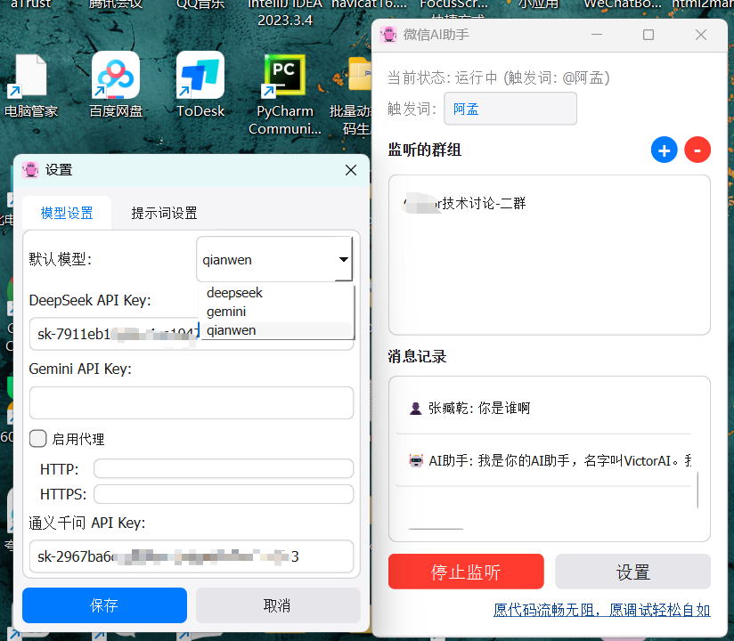
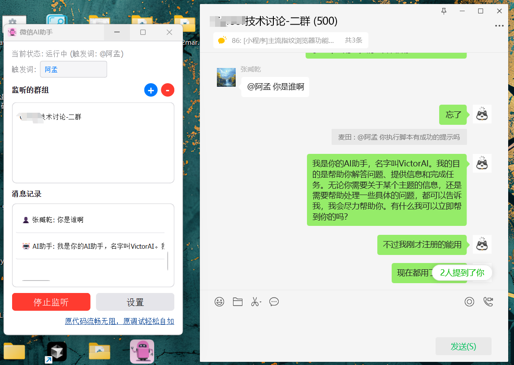

# WeChatAI 智能助手（二开）

## 项目介绍
WeChatAI 是一款基于 Python 开发的微信聊天的智能助手，支持多种大语言模型，可以实现智能对话、自动回复等功能。采用现代化的界面设计，操作简单直观。

**🎉 最新更新：重构AI配置系统，支持更多AI提供商和现代化UI设计！**

[原项目地址](https://github.com/Vita0519/WeChatAI)]

## 功能特点
- 🤖 支持多个AI模型（DeepSeek、Gemini、通义千问、OpenAI、NewAPI）
- 👥 支持多个人/群组同时监听
- 🎯 自定义触发词
- 📝 实时消息记录显示
- 🎨 现代化UI设计，支持多种预设主题
- 📌 支持窗口置顶
- 🔒 问答数据本地存储，保护隐私
- ⚡ 支持流式响应，实时显示AI回复
- 🔧 现代化配置系统，支持连接测试
- 📋 预设提示词模板，快速配置AI角色
  
## 使用截图



## 系统要求
- Windows 10/11 64位操作系统
- 微信 PC 版本 >= 3.9.0
- 网络连接稳定

## 安装说明
1. git clone后，运行requirements.txt文件，安装依赖
2. 使用pyinstaller打包，生成WeChatAI.exe
3. 确保微信已登录并保持运行
4. 运行 WeChatAI.exe 即可使用


## 使用指南

### 基本设置
1. 启动程序后，点击"设置"按钮配置 AI 模型的 API 密钥
2. 选择默认的AI提供商和模型
3. 在主界面设置触发词（默认为"AI"）
4. 点击"+"按钮添加需要监听的微信群/个人（有备注填备注，无备注填昵称）
5. 点击"开始监听"启动服务

**电脑性能决定了启动监听的速度，同时监听的数量，建议不要超过3个**

### 新功能使用

#### 配置迁移
如果您是从旧版本升级，请运行配置迁移工具：
```bash
python migrate_config.py
```

#### AI提供商配置
- **DeepSeek**: 开源大语言模型，性价比高
- **Gemini**: Google多模态AI，支持图文理解
- **通义千问**: 阿里云大语言模型
- **OpenAI**: 官方GPT模型，功能强大
- **NewAPI**: 支持自建或第三方兼容服务

#### 预设提示词
在设置页面可以选择预设的AI角色：
- 友善助手：温和耐心的对话风格
- 专业助手：严谨客观的回答方式
- 创意助手：富有想象力的创新思维
- 技术专家：专业的技术问题解答
- 翻译助手：准确的多语言翻译

### 日常使用
1. 在已添加的微信群/个人中，使用 "@AI" 或设定的触发词来召唤 AI
2. AI 将自动回复消息
3. 主界面实时显示对话记录
4. 可随时添加或移除监听的群组

### 注意事项
- 请确保微信处于登录状态
- 添加群组时需要输入完整的群名称
- 建议使用自己的 API 密钥以获得最佳体验
- 程序关闭后需要重新启动监听服务

## 常见问题

### 无法启动监听
- 检查微信是否正常运行
- 确认是否已添加群组
- 验证 API 密钥是否正确配置

### 群组添加失败
- 确保群名称输入正确
- 检查是否已经添加过该群组
- 确认微信窗口正常显示

### AI 无响应
- 检查网络连接
- 验证 API 密钥有效性
- 确认触发词使用正确


---


## 许可协议
[GPL](https://opensource.org/license/gpl-1-0)

## 免责声明
本软件仅供学习交流使用，请勿用于商业用途。使用本软件产生的任何后果由用户自行承担。
